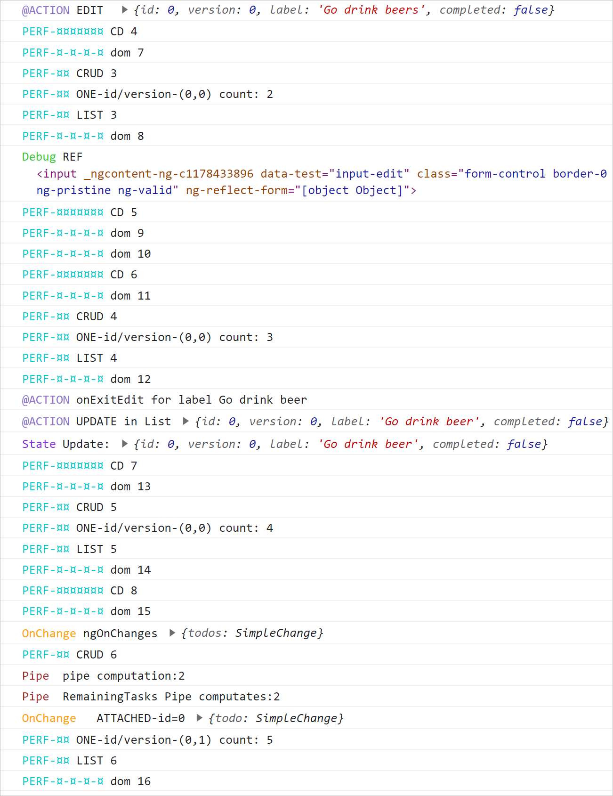
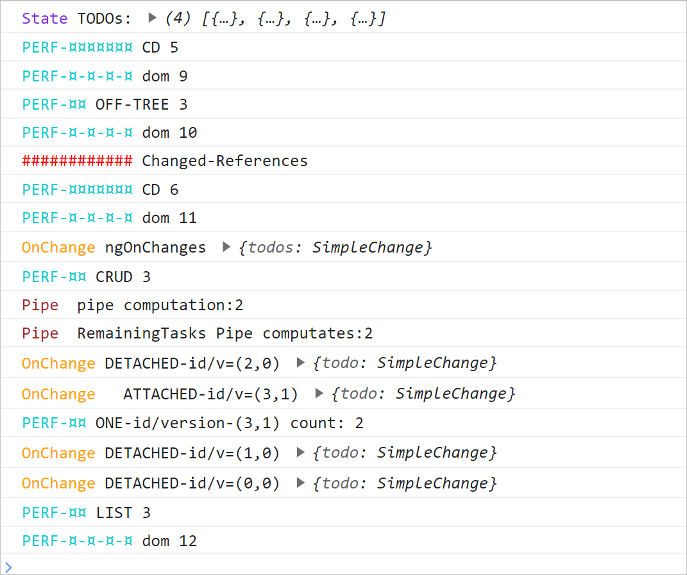

# Advanced Performance Tools (cd.detach, cd.reattach)

With trackBy we optimize the list by preventing ANGULAR to recreate the components when the data change of reference.
But we still have the refresh of the components.

Detail:

- Angular keeps the SAME components, BUT they are still refreshed because even with OnPush Angular can not tell if the
  inside data is the same or not. For an OnPush component if the reference has changed => the component will be
  refreshed. THere is no direct way to tell Angular.

## Advanced Performance Tools (cd.detach, cd.reattach)

In the Angular refresh cycle a component is called on DoCheck and ngOnChanges BEFORE the REFRESH really occurs. In those
methods we can call cd.detach() to prevent the refresh to occur. Or/Then we can call cd.reattach() to tell Angular to
consider the component.

The best is to code some logic in ngOnChanges and do the check of "change" by our own rules (not only that the ref has
changed).

- if the component is called on onChanges() => it means that the ref has changed.
- If we check that we don't want any refersh => we can detach the component.
- NOTE : ngOnChanges is called even if the component is detached, so we'll be able to later reattach the component to
  the tree if we consider that it has changed.
- detaching/attach is a way to customize the refresh "method" of a component (something smilar to trackby).
- It is just more complicated because Angular does not provide a custimzation method for OnPush comparison (it is always
  the triple equal === method )

## Scenario

In a real life scenario the Todo entity would most probably have a version number. And we would use this version number.

- So to demonstrate the pattern describe above : detach/attch list optimization, we'll add a version number to the Todo
  entity.
- To test we will simulate a reordering of the list done on the remote where some of the remote entities had been
  changed by changing the version number of the Todo instances.

## Implementation

- modif in the Todo entity to add a version number
- modif in the TodoService to simulate a change of version number, each time there is a change to a Todo
    - update
    - toggleAll

## Result

With NO MODIFICATION, Simple update name scenario

- For 'Go to Mars'
- With "SameRefs"

- On app load
- PERF-¤¤ ONE-id/version-(3,0) count: 1
- click edit
- PERF-¤¤ ONE-id/version-(3,0) count: 2
- Remove the last s from Mars => one refresh per keyinput => so here one CD refresh
- PERF-¤¤ ONE-id/version-(3,0) count: 3
- enter
- PERF-¤¤ ONE-id/version-(3,0) count: 4 (no label change yet ... waiting for the async response from the server)
- Our UI pattern is pessimistic, the FormControl had the updated value, but NOT the Todos from the state YET.
- then 2 sec later because of the async simulated reponse from the server
- PERF-¤¤ ONE-id/version-(3,0) count: 5

HERE SameRefs or not is the same for the Todo.id=3, with NewRefs it would be the same. But for the other Todos, with
NewRefs we would have a refresh of all those other OneComponent fro the last CD cycle (data unchanged, but refs
changed).

## with NewRefs and implementation of version updates

If we don't implement the detach/attach optimization, the previous behavior is exactly the same..

With the implementation of the detach/attach optimization. Refresh wih a change of REF will be te same has with same
REFS. Because now only id/version is checked. So it is the same as changing the refs only when we update the instance.
NOW all refs are changed by the faked remote, BUT if the id/version is the same, the component will not be refreshed. SO
it ends up with only the component for the updated Todo being refreshed because its id/version has changed.

We now have ONLY one OneComponent refreshed, the one for the updated Todo.

## Second scenario

Reorder with NewRefs

We see that the OneComponent stay detached.

SO we have no recreation, and no refresh (even id reordered) for the OneComponent when ReOrder.

If we simulate an update for id=3 when reordering, we change the version to ++. In that case only the OneComponent for
id=3 is re ATTACHED and then refreshed.

- PERF-¤¤ ONE-id/version-(3,1) count: 2

