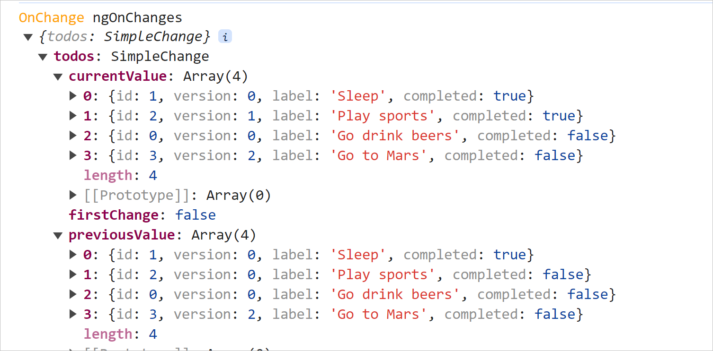

# detach-reattach strategy

## Bug CORRECTED for re-attach/detach optimization

When a OneComponent is detached, it is not refreshed anymore.

So when we click to edit => the template can NOT show the ng-template containing the input and so the this.inputEditRef
is always undefined.

To correct that : when we EDIT we have to switch back to ATTACH mode

## when we update the complete fflag of a Todo
The stateservice increment the version to force the OneCOmponent to refresh

