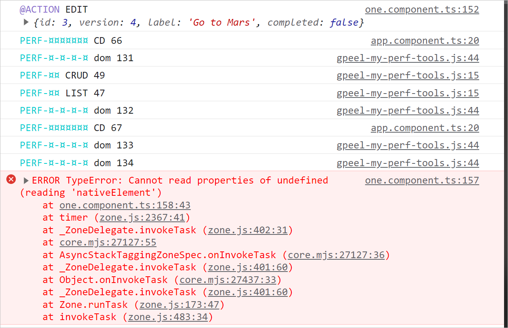

# Going Optimistic

In the OneComponent, we have a FormControl for the name of the Todo. We have seen that the FormControl is updated on key
input, but the Todo instance is updated async BY a FAKE ROUNDTRIP TO THE SERVER only when the user press enter.

THe delay is 4000 ms. to be able to see the delayed process of the refresh of the OneComponent.

In TodoStateService, setTodos() method, we have a setTimeout() to simulate the async response from the server.

````typescript
    setTimeout(() => {
  if (this.changeReference) Plog.red('Changed-References');
  this.todos$.next(this.todos);
}, 4000);
````

## We are not optimistic

During the roundtrip to the server, the user can't do anything, the OneComponent is not refreshed to the value just
submitted.And the User sees the old value in the UI. not really good. We could lock the screen with a spinner.

The other solution is to be optimistic, we would like to see the new value in the UI as soon as the user press enter
BEFORE the server roudtrip wait.

At this return we can check if it is reconcilable with the server state. Or just take the server value as the new
reference. THat is the optimistic part. Here we'll take the server value as the new reference even if were not the
optimistic value we kept in the meanwhile. But since we fake the server, in our example we know that the server value is
the optimistic value.

In real life reconciliation is the difficut part.

Also we shoudl ask ourslves what the user can do in the meanwhile (ie while waiting for the server response).

## Implementation

Before emitting on the Output, we'll update a local lable value which is ging to be taken by the HTML template in
preference to the FormControl value.

````typescript
this.optimisticTransientLabelValue = label;
this.updateTodo.emit({...this.editingTodo, label});
````

````html
<label [for]="'todo_'+ todo.id">
  {{ optimisticTransientLabelValue ? optimisticTransientLabelValue : todo.label }}</label>
````

## Bug for attch/detach optimization

When a OneComponent is detached, it is not refreshed anymore.

So when we click to edit => the template can NOT show the ng-template containing the input and so the this.inputEditRef
is always undefined.



To correct that : when we EDIT switch back to ATTACH mode
